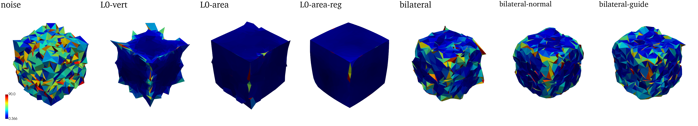
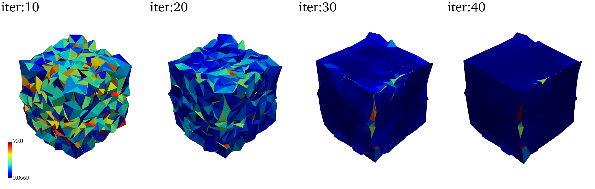

# SMD-lab

<div align="center">

简体中文 | [English](README_en.md)
</div>


## 🌈简介

SMD-lab旨在提供一个跨平台、开箱即用的保特征网格降噪算法工具，覆盖多种基于稀疏优化的网格降噪算法，用于测试和比较不同算法（包括公开论文的未开源算法）在处理网格数据时的效果。这个项目的目标是个人的学习研究，但同时也希望能帮助研究者和从业者评估、比较和改进他们的算法。期望这个项目能够为未来的研究与应用提供有价值的参考。

| $L_0$优化                                                    | 压缩感知                                                     | 低秩分解                                                     | 滤波                                                         |
| ------------------------------------------------------------ | ------------------------------------------------------------ | ------------------------------------------------------------ | ------------------------------------------------------------ |
| [(SIGGRAPH'13) Mesh denoising via *L*0 minimization](https://dl.acm.org/doi/10.1145/2461912.2461965) | [(SIGGRAPH'14) Decoupling Noises and Features via Weighted *l*1-analysis Compressed Sensing](http://staff.ustc.edu.cn/~lgliu/Projects/2014_DecouplingNoise/default.htm) | [(Proc. PG'18) Non-Local Low-Rank Normal Filtering for Mesh Denoising](https://onlinelibrary.wiley.com/doi/abs/10.1111/cgf.13556) | [(SIGGRAPH'03) Bilateral mesh denoising](https://dl.acm.org/doi/10.1145/882262.882368) |
|                                                              |                                                              |                                                              | [(TVCG'11) Bilateral Normal Filtering for Mesh Denoising](https://dl.acm.org/doi/10.1109/TVCG.2010.264) |
|                                                              |                                                              |                                                              | [(Proc. PG'15) Guided Mesh Normal Filtering](http://staff.ustc.edu.cn/~juyong/GuidedFilter.html) |

该项目正在持续编写中，已复现的算法可以查看[图](###hello world!)

## 使用

```
git submodule update --init --recursive
```

### 编译

windows： 双击运行`bash/build.bat` (请确保安装[mingw64](https://sourceforge.net/projects/mingw-w64/files/)和cmake并添加至环境路径)

若安装了CUDA toolkit（[我的使用版本](https://developer.nvidia.com/cuda-downloads?target_os=Windows&target_arch=x86_64&target_version=10&target_type=exe_local)），则会自动识别并编译GPU程序。在windows下，需要安装VS Studio并将cl.exe添加至环境路径，并且先以管理员权限运行`cuda.bat`。

```
Hint: For new Visual Studio cl.exe is present in path => C:\Program Files (x86)\Microsoft Visual Studio\2019\Community\VC\Tools\MSVC\14.23.28105\bin\Hostx64\x64
x64 is for 64bit
x86 is for 32bit
```

### 创建python环境 (可选)

我们使用python脚本来实现数据统计、可视化等任务

```
conda create -n SMD python=3.8
conda activate SMD
conda install -c conda-forge openmesh-python
pip install pyvista
```

## 项目文件说明

- `src/` 源文件
  - `[论文算法]/`
  - `dependencies/` 
  - `utils/` 

- `data/` 数据集
  - `thingi10K/` （需下载）
  - `printobject/` （需下载）
  - ...
  - `examples/`  
  
- `bash/`
  - `*.bat` win下的任务
  - `*.sh` linux下的任务
- `scripts/` 脚本
- `run/`
  - `[具体任务]/`
    - `gt`
    - `noise`
    - `denoised`


## 运行

### hello world!

在windows下，双击`bash/test_cube.bat` 

完成！ 你可以在当前命令行窗口看到这些算法的执行时间，以及对应降噪结果的不同指标（详细内容参见[降噪结果评估](#降噪结果评估)）你可以在`run/test_cube`下看到不同算法和不同参数的降噪结果。其中log文件夹下包含了HQS迭代求解时中间过程的所有能量和对应的网格模型。

接下来，通过执行`scripts/cube_vis.py`，可以生成以下的可视化结果:

各种算法对含$\sigma=0.7l_e$高斯噪声的网格的降噪结果，可视化为法向差异（$\degree$为单位）



L0算法在迭代过程中的变化



### 一般使用

SMD使用[clipp](https://github.com/muellan/clipp)来解析命令行参数，`build/`下包含所有的可执行文件，只需要在命令行下输入可执行文件名称，即可获得该程序的使用信息。


## 数据集

| 合成数据集    | 真实数据集    |
| ------------- | ------------- |
| Thingi10K[^2] | PrintData[^3] |
| Synthetic[^1] | Kinect v1[^1] |
|               | Kinect v2[^1] |
|               | Kinect F[^1]  |


由于空间和版权原因，仓库内不包含这些数据集，它们可以在以下网站进行下载：

- [1] https://wang-ps.github.io/denoising.html
- [2] https://ten-thousand-models.appspot.com (a)
- [2] https://www.kaggle.com/datasets/lukaszfuszara/thingi10k-name-and-category/data (b)
- [3] https://drive.google.com/file/d/1x561-v3z1j0q_1qHYG0Fja1W-sqjhYpC/view


解压后，`data`下的文件为

```
└── data
    ├── examples
    ├── Kinect_Fusion
    ├── Kinect_v1
    ├── Kinect_v2
    ├── Syhthetic
    ├── Thingi10K / Thingi10K_name_and_category
    └── PrintedDataset
```

你可以使用提供的python脚本来轻松地创建测试数据集的任务

```
conda activate SMD
```

### Thingi10K

(a)

```
python scripts/thingi10k.py
--num [指定网格的数量] //默认为10
--job_name [任务名称，将在run目录下创建这一任务] //默认自动创建thingi10k_00x
--denoise_command [降噪单个模型的参数，不需要指定输入输出文件] //默认为默认参数的L0算法
--noise_command [为单个模型添加噪声的参数，不需要指定输入输出文件] //为默认参数的添加噪声
```


(b)

```
python scripts/thingi10k_nc.py
--folder [选择thingi10k文件下一级的类别] //默认为执行全选所有类别
--job_name [任务名称，将在run目录下创建这一任务] //默认自动创建thingi10k_00x
--denoise_command [降噪单个模型的参数，不需要指定输入输出文件] //默认为默认参数的L0算法
--noise_command [为单个模型添加噪声的参数，不需要指定输入输出文件] //默认为默认参数的添加噪声
```


### PrintData

（该数据集无需手动添加噪声）

```
python scripts/printdata.py
--job_name [任务名称，将在run目录下创建这一任务] //默认自动创建printdata_00x
--noise_command [为单个模型添加噪声的参数，不需要指定输入输出文件] //默认为默认参数的L0算法
```


### Kinect系列/Synthetic

（该数据集无需手动添加噪声）

```
python scripts/kinect.py
--job_name [任务名称，将在run目录下创建这一任务] //默认自动创建kinect_00x
--noise_command [为单个模型添加噪声的参数，不需要指定输入输出文件] //默认为默认参数的L0算法
--dataset [可选v1、v2、f、s，分别对应Kinect v1,Kinect v2,Kinect F,Synthetic] //默认为合成数据集
```


注：其中(a)是Thingi10K的官方版本，`.tar.gz`格式，在windows下运行`tar -xvzf Thingi10K.tar.gz`解压。然而，该版本只包含网格，相关信息需要使用`http://www.thingiverse.com/download:{file_id}`查询。因此，这里提供了另一个Thingi10K的kaggle版本(b),包含了类别和名称信息,方便查看特定类别的网格降噪效果（非完整）

## 降噪结果评估

### 平均豪斯多夫距离（AHD）

$$
E_v=\frac{1}{N_vL_d}\sum_{v^r_i\in v^r_M}
\min_{\tilde{v}_j\in\tilde{V}_m}\Vert v^r_i-\tilde{v}_j \Vert
$$

### 平均法向角距离（AAD）

$$
E_a=\frac{1}{N_f}\sum_{f^r_i\in F^r} \mathrm{acos}(n^r_i \cdot \tilde{n}_i)
$$

结果以角度为单位

### 翻折边比例（OEP）

基于$L_0$论文中folded triangle的可视化，使用边所对应的二面角进行网格评估，给出一个定量度量
$$
E_f=\frac{1}{N_e}\sum_{e^r_i\in F^r} \tau(e^r_i)
\\
\tau(e)=\begin{cases}
1&\mathrm{dihedral\ angle}(e)<30^\circ
\\
0&\mathrm{otherwise}
\end{cases}
$$


## 相关文献

[^1]: Mesh denoising via cascaded normal regression
[^2]:Thingi10K: A Dataset of 10,000 3D-Printing Models
[^3]:GCN-Denoiser: Mesh Denoising with Graph Convolutional Networks


TODO:

TVCG11的全局方法未实现

Thingi10K(a) 使用`lib::read_triangle_mesh`直接读取stl添加噪声（结果不对）

Thingi10K(b) 先使用openmesh转换为obj（中间报错），再对obj文件添加噪声，结果正确（太慢）

