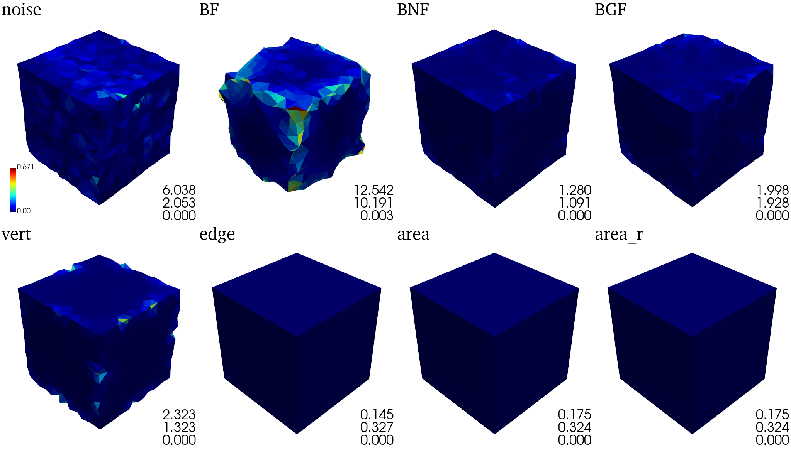
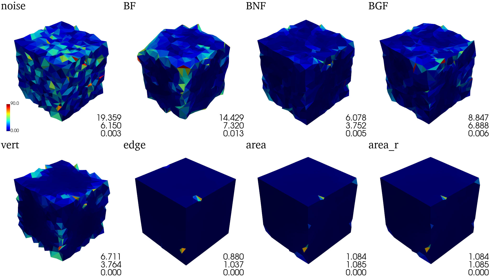
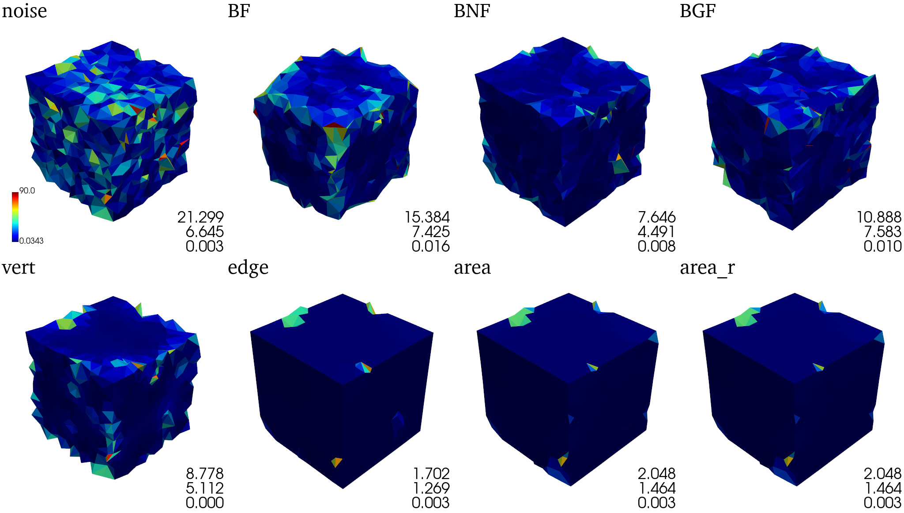
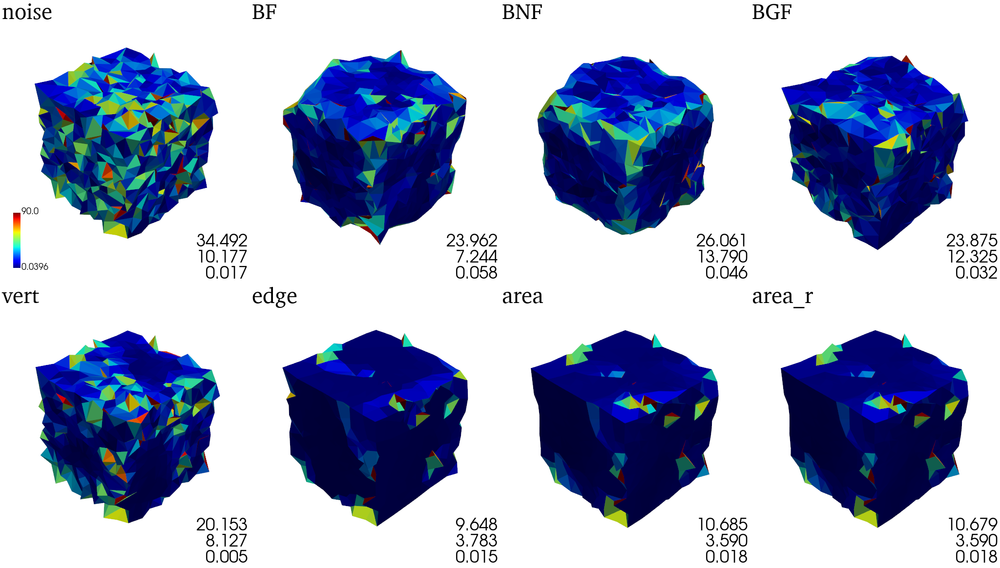
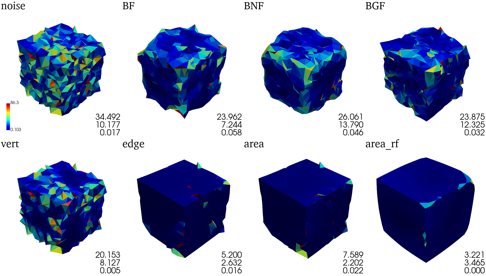
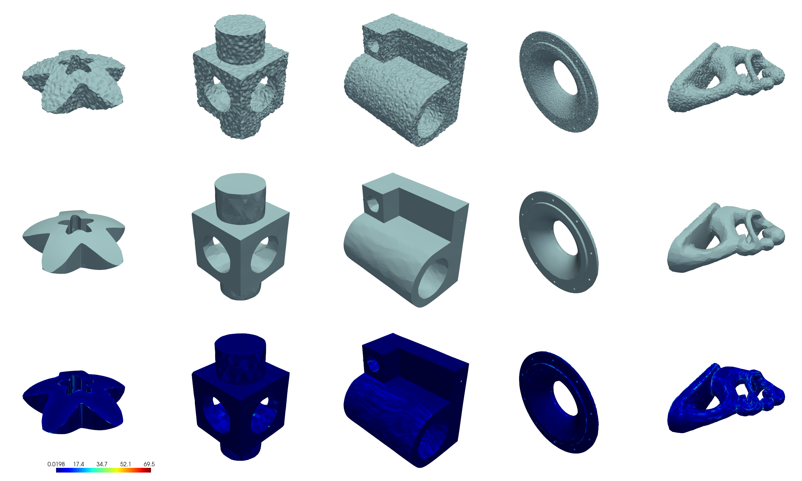
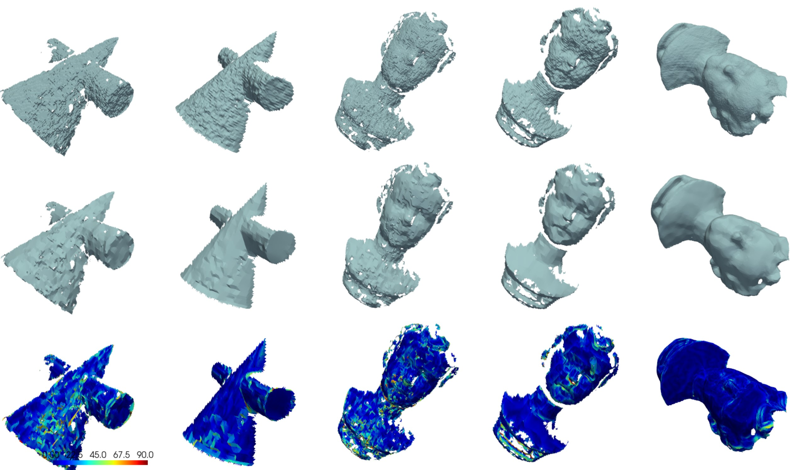
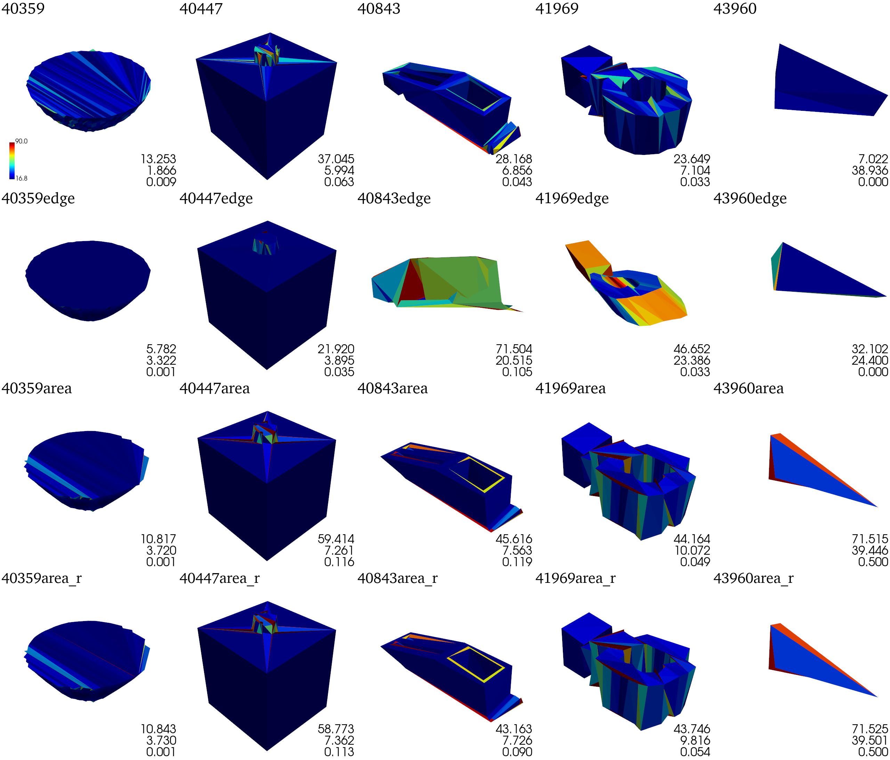

# 🌈简介

SMD是一个高性能的网格保特征算法去噪复现合集。基于facet-index的数据结构复现了该领域的多篇代表性论文。作为sayoriaaa的本科毕业设计，它包含以下论文的复现：

| 滤波                                                         | 稀疏正则化                                                   | 压缩感知                                                     |
| ------------------------------------------------------------ | ------------------------------------------------------------ | ------------------------------------------------------------ |
| [(SIGGRAPH'03) Bilateral mesh denoising](https://dl.acm.org/doi/10.1145/882262.882368) | [(SIGGRAPH'13) Mesh denoising via *L*0 minimization](https://dl.acm.org/doi/10.1145/2461912.2461965) | [(SIGGRAPH'14) Decoupling Noises and Features via Weighted *l*1-analysis Compressed Sensing](http://staff.ustc.edu.cn/~lgliu/Projects/2014_DecouplingNoise/default.htm) |
| [(TVCG'11) Bilateral Normal Filtering for Mesh Denoising](https://dl.acm.org/doi/10.1109/TVCG.2010.264) | [(CAD'13) Feature-preserving filtering with L0 gradient minimization](https://dl.acm.org/doi/10.1016/j.cag.2013.10.025) |                                                              |
| [(Proc. PG'15) Guided Mesh Normal Filtering](http://staff.ustc.edu.cn/~juyong/GuidedFilter.html) |                                                              |                                                              |


# 使用

本项目使用较为通用，这里是[详细资料](docs/usage.md)

# 项目文件说明

- `src/` 源文件
  - `[论文算法]/`
  - `dependencies/` 
  - `utils/` 
- `data/` 数据集
- `docs/` 文档
- `bash/`
  - `*.bat` win下的任务
  - `*.sh` linux下的任务
- `scripts/` 脚本
- `run/`
  - `[具体任务]/`
    - `gt`
    - `noise`
    - `denoised`
    - `time.json` 记录每个网格去噪的时间开销


# 运行

## 测试正方体

正方体是一个理想的用来测试保特征网格去噪算法的用例，因为传统的去噪算法无法在边缘处获得理想的效果。

在windows下，我们提供了`bash/test_cube.bat`脚本。你可以很方便地修改`work_dir`和`noise_sigma`，用以创造结果不同的保存目录和包含不同强度的高斯噪声的网格作为输入的实验。比如，`noise_sigma=0.3`说明高斯噪声强度为$\sigma=0.3l_e$，其中$l_e$是网格的平均边长。

双击运行`bash/test_cube.bat`脚本，`work_dir`会生成输出网格以及文件`metric.txt`，包含对应的[降噪结果评估](#降噪结果评估)。在`scripts/cube_vis.py`指明`work_dir`并运行，将生成基于法向差异表示的可视化结果，左上角为算法名，右下角由上至下依次为平均法向角距离（单位为$\degree$）、平均豪斯多夫距离（单位为$10^{-3}$）、翻折边比例。

### $\sigma=0.1l_e$



### $\sigma=0.3l_e$



下面我们在$\sigma=0.3l_e$的基础上加上了比例为$0.1$，强度为$0.7$的冲击噪声



### $\sigma=0.5l_e$



可以看到，在$\sigma=0.5l_e$的情况下，使用原论文的默认参数会导致较多的尖刺，因此我们将$\lambda$设置为默认的两倍，并在正则化中取消正则项衰减的策略，可以获得最低的平均法向角距离。



其中log文件夹下包含了$L_0$算法求解时中间过程的所有能量和对应的网格模型。可视化如下图：


注：额外用matplotlib+PPT画的，代码不包含在本仓库中

## 测试更多模型

诚然，一个正方体模型不足以反映去噪算法的全貌，我们需要更多的模型进行测试！一般来说，这些模型分为仿真数据和真实数据两类

比如，我们的$L_0$算法运行在部分仿真数据上的结果为



运行在部分真实数据上的结果为



这些模型来自以下的数据集

### 测试数据集

SMD支持两篇论文所提供的数据集：CNR提供的合成数据集Synthetic，扫描数据集Kinect v1、Kinect v2、Kinect F；GCN提供的扫描数据集PrintData。

它们可以分别在https://wang-ps.github.io/denoising.html和https://drive.google.com/file/d/1x561-v3z1j0q_1qHYG0Fja1W-sqjhYpC/view下载

解压后，`data`下的文件为

```
└── data
    ├── examples
    ├── Kinect_Fusion
    ├── Kinect_v1
    ├── Kinect_v2
    ├── Synthetic
    └── PrintedDataset
```

其中`examples`下包含一些特殊的模型：`cube7`存在一些自交的边，可以使得$L_0$的edge方法fail掉。还有一些非规整网格。

PrintData数据集提供的噪声网格存在拓扑问题，对于一些算法会失效，因此需要先运行

```
python scripts/refine_pd.py
```

得到修复后的`PrintedDataset_r`数据集

通过`scripts/dataset.py`可一键运行数据集任务，使用`-h`查看帮助信息。e.g. 执行

```
python scripts/dataset.py --dataset PrintedDataset --metrics_args "--ahd --oep"
```

### 测试非规整网格

我们增加了对非规整网格的测试作为数据集的补充，因为数据集的模型往往是规整网格。这些非规整网格来自于`thingi10K`，将它们流形化后存放在`dataset/examples`中。在我们的测试中，基于edge的算子要好于基于area的算子，猜测这是因为非规整网格中存在较多 大面积三角形-小面积三角形 相邻的情况，这使得基于area的算子自动减少了优化的权重。



## 测试自定义模型

此外，当然还可以直接用编译好的程序运行任意的模型。SMD使用[clipp](https://github.com/muellan/clipp)来解析命令行参数，`build/`下包含所有的可执行文件，只需要在命令行下输入可执行文件名称，即可获得该程序的使用信息。


# 降噪结果评估

## 平均豪斯多夫距离（AHD）

$$
E_v=\frac{1}{N_vL_d}\sum_{v^r_i\in v^r_M}
\min_{\tilde{v}_j\in\tilde{V}_m}\Vert v^r_i-\tilde{v}_j \Vert
$$

## 平均法向角距离（AAD）

$$
E_a=\frac{1}{N_f}\sum_{f^r_i\in F^r} \mathrm{acos}(n^r_i \cdot \tilde{n}_i)
$$

结果以角度为单位

## 翻折边比例（OEP）

基于$L_0$论文中folded triangle的可视化，使用边所对应的二面角进行网格评估，给出一个定量度量

$$
E_f=\frac{1}{N_e}\sum_{e^r_i\in F^r} \tau(e^r_i)
\\
\tau(e)=\begin{cases}
1&\mathrm{dihedral\ angle}(e)<30^\circ
\\
0&\mathrm{otherwise}
\end{cases}
$$

# 其他

对于以上的说明，进一步的解释在我的毕业论文中，在`docs`目录下。

$\mathcal{Note:}$ sig'14的算法只实现了第一部分，原计划第二部分是用julia来实现，因为C++绑定solver太麻烦了。PG'15的算法没有验证，实现思路仅供参考。由于后来导师只让论文写一篇的实现，再加上事情也很多，所以就没动力继续写下去了。


