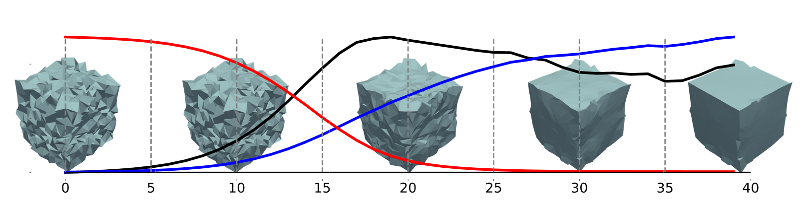
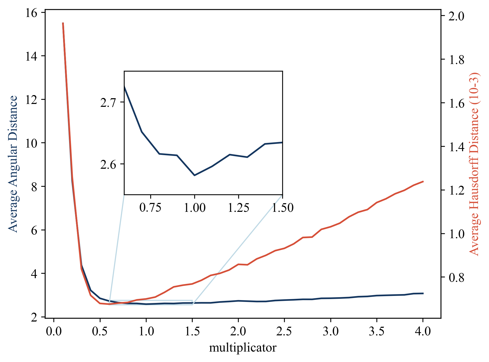

# 🌈简介



SMD是一个高性能的网格保特征算法去噪复现合集。基于facet-index的数据结构复现了该领域的多篇代表性论文。作为sayoriaaa的本科毕业设计，它包含以下论文的复现：

| 滤波                                                         | 稀疏正则化                                                   | 压缩感知                                                     |
| ------------------------------------------------------------ | ------------------------------------------------------------ | ------------------------------------------------------------ |
| [(SIGGRAPH'03) Bilateral mesh denoising](https://dl.acm.org/doi/10.1145/882262.882368) | [(SIGGRAPH'13) Mesh denoising via *L*0 minimization](https://dl.acm.org/doi/10.1145/2461912.2461965) | [(SIGGRAPH'14) Decoupling Noises and Features via Weighted *l*1-analysis Compressed Sensing](http://staff.ustc.edu.cn/~lgliu/Projects/2014_DecouplingNoise/default.htm) |
| [(TVCG'11) Bilateral Normal Filtering for Mesh Denoising](https://dl.acm.org/doi/10.1109/TVCG.2010.264) | [(CAD'13) Feature-preserving filtering with L0 gradient minimization](https://dl.acm.org/doi/10.1016/j.cag.2013.10.025) |                                                              |
| [(Proc. PG'15) Guided Mesh Normal Filtering](http://staff.ustc.edu.cn/~juyong/GuidedFilter.html) |                                                              |                                                              |


# 使用

本项目使用较为通用，这里是[详细资料](docs/usage.md)

# 项目文件说明

- `src/` 源文件
  - `[论文算法]/`
  - `dependencies/` 
  - `utils/` 
- `data/` 数据集
- `docs/` 文档
- `bash/`
  - `*.bat` win下的任务
  - `*.sh` linux下的任务
- `scripts/` 一些封装的python函数
- `run/`
  - `[具体任务]/`
    - `xxx.obj` 去噪后的网格
    - `time.txt` 记录每个网格去噪的时间开销
    - `metric.txt` 记录每个网格的[指标](#降噪结果评估)

`metric.txt`中的格式如下：
```
NAME:40359 
DENOISED:run/ir2/40359 
GT:data/examples/40359 
AAD:25.8935
AHD:0.0037325
OEP:0.016092
```

`time.txt`的格式如下（首项和末项格式固定）：
```
NAME:40359edge 
SMD-L0: C++ implementation of "Mesh Denoising via L0 Minimization" 
Average dihedral angle: 32.6038
lambda: 2.10814
alpha: 0
Execution time: 139.537 ms
```


# 运行

本项目提供了windows下的一些批处理测试脚本，一键在`run`目录下生成对应的文件。

它们包括

- `test_cube.bat`：测试不同算法在cube模型下的去噪效果，可修改cube的噪声强度等
- `test_ir.bat`：测试不同非规整网格在不同$L_0$方法下的去噪效果
- `test_selected.bat`：测试从Synthetic、Kinect系列数据集中选取的25个模型，在$L_0$方法默认参数下的去噪效果
- `test_robust.bat`：测试从$L_0$算法超参数$\lambda$的鲁棒性、亦可用于选取最优参数

这些脚本提供了注释，根据这些注释的提示修改`set=`的内容，便可以进行同类实验。在生成文件后，可以在`make_figure.ipynb`中找到对应任务的可视化代码。如果是自定义任务（即根据bat注释进行了修改），修改cell内的`proj_name`即可。

执行可视化后，在`exp`目录下会保存图像，比如`test_robust.bat`对应的任务可视化图为



# 数据集

`test_selected.bat`等脚本需要包含额外的数据集：CNR提供的合成数据集Synthetic，扫描数据集Kinect v1、Kinect v2、Kinect F；GCN提供的扫描数据集PrintData。

它们可以分别在 https://wang-ps.github.io/denoising.html 和 https://drive.google.com/file/d/1x561-v3z1j0q_1qHYG0Fja1W-sqjhYpC/view下载

解压后，`data`下的文件为

```
└── data
    ├── examples
    ├── Kinect_Fusion
    ├── Kinect_v1
    ├── Kinect_v2
    ├── Synthetic
    └── PrintedDataset
```

# 降噪结果评估

## 平均豪斯多夫距离（AHD）

$$
E_v=\frac{1}{N_vL_d}\sum_{v^r_i\in v^r_M}
\min_{\tilde{v}_j\in\tilde{V}_m}\Vert v^r_i-\tilde{v}_j \Vert
$$

## 平均法向角距离（AAD）

$$
E_a=\frac{1}{N_f}\sum_{f^r_i\in F^r} \mathrm{acos}(n^r_i \cdot \tilde{n}_i)
$$

结果以角度为单位

## 翻折边比例（OEP）

基于$L_0$论文中folded triangle的可视化，使用边所对应的二面角进行网格评估，给出一个定量度量

$$
E_f=\frac{1}{N_e}\sum_{e^r_i\in F^r} \tau(e^r_i)
\\
\tau(e)=\begin{cases}
1&\mathrm{dihedral\ angle}(e)<30^\circ
\\
0&\mathrm{otherwise}
\end{cases}
$$


